#  Bienvenidos a mi GitHub

Aquí encontrarás proyectos personales desarrollados con tecnologías como Java, Spring Boot, Playwright, C#/.NET, Linux, Docker y PostgreSQL, orientados a aplicar conocimientos, resolver problemas y seguir desarrollando mis competencias técnicas.

#  Proyectos

 

 

 

 

 

---

